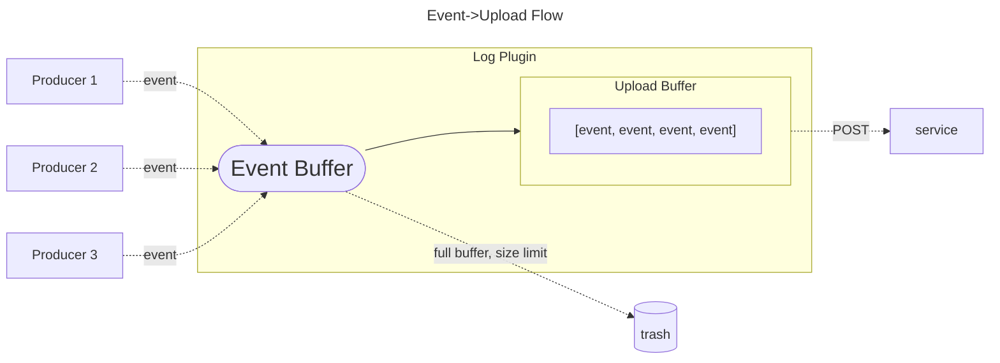

# Decision Log Plugin

The decision log plugin is responsible for gathering decision events from multiple sources and upload them to a service.
[This plugin is highly configurable](https://www.openpolicyagent.org/docs/latest/configuration/#decision-logs), allowing the user to decide when to upload, drop or proxy a logged event.

Events are uploaded in gzip compressed JSON array's at a user defined interval.

